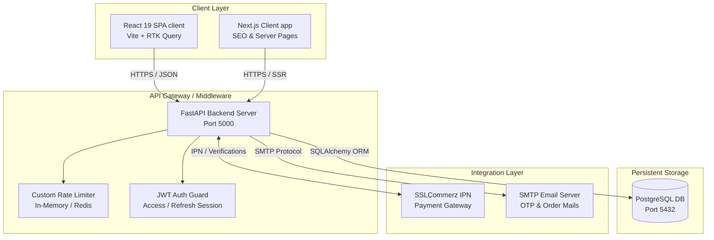

# 🏥 MediShop - Full-Stack Healthcare & Medical Equipment E-commerce Platform

Welcome to the comprehensive repository of **MediShop**, a production-grade, full-stack e-commerce application designed for health products, medicine delivery, and medical equipment. 

This repository houses a modular backend powered by **Python FastAPI** and **PostgreSQL**, alongside a modern, state-of-the-art frontend SPA built with **React 19**, **Vite**, **Redux Toolkit (RTK Query)**, and **Tailwind CSS v4**.

---

## 📐 System Architecture

The following diagram illustrates how the frontend clients, backend server, database, and third-party payment gateways integrate:



---

## 📂 Codebase Directory Structure

The project is structured into three main modules: the backend server, the React-Vite client, and the Next.js migration directory:

```bash
MediShop/
├── docker-compose.yml           # Unified orchestration for Postgres, Backend, and Frontend
├── development_upcoming.md      # Strategic performance scaling & 6-month roadmap
├── Post-Production-TODO.md      # Detailed post-production audit checklists
├── sqa_review_report.md         # Quality assurance findings and remediation logs
├── workplane.md                 # Order workflow checklist
│
├── medistore-server/            # Python FastAPI Backend Module
│   ├── src/
│   │   ├── database/            # Database engine & connection session wrapper
│   │   ├── dependencies/        # Global route dependencies & JWT validation guards
│   │   ├── modules/             # Modular API domains (Auth, Users, Products, Orders, etc.)
│   │   ├── utils/               # Storage, custom rate limiters, cache & email utilities
│   │   └── main.py              # Application entrypoint & HTTP middlewares
│   ├── tests/                   # Pytest automation suite
│   ├── Dockerfile               # Backend lightweight python container configuration
│   └── requirements.txt         # Python server libraries list
│
└── medi_store_client/           # React 19 Frontend SPA Module
    ├── src/
    │   ├── Layout/              # Customer & Admin sidebar layouts
    │   ├── Routes/              # React Router path declarations & auth guards
    │   ├── redux/               # Redux Toolkit, Store setup, & RTK Query slices
    │   └── Pages/               # Admin dashboards & Customer shopping screens
    ├── Dockerfile               # Client Node deployment container setup
    └── package.json             # JS dev & runtime dependency configurations
```

---

## ⚡ Quick Start

You can run the entire platform using Docker Compose, or run the backend and frontend components individually.

### Option 1: Run Everything using Docker (Recommended)

Make sure you have Docker and Docker Compose installed. Then, simply execute the following command in the workspace root directory:

```bash
docker-compose up --build
```

This commands spins up:
*   **PostgreSQL Database** at `localhost:5432`
*   **FastAPI Backend Server** at `http://localhost:5000` (API documentation accessible at `/docs`)
*   **React Frontend Client** at `http://localhost:5173`

---

### Option 2: Run Backend and Frontend Manually

#### 1. Backend Server Setup (`medistore-server`)

Navigate to the [medistore-server](file:///d:/Bijoy/MediShop/medistore-server/) directory:

```bash
cd medistore-server
```

Create a virtual environment and install backend dependencies:

```bash
# Create python venv
python -m venv .venv

# Activate venv (Windows)
.venv\Scripts\activate

# Install requirements
pip install -r requirements.txt
```

Set up your `.env` configuration file (see the [Environment Variables](#-environment-variables) section below for reference), and launch the development server:

```bash
uvicorn src.main:app --reload --port 5000
```

#### 2. Frontend Client Setup (`medi_store_client`)

Navigate to the [medi_store_client](file:///d:/Bijoy/MediShop/medi_store_client/) directory:

```bash
cd ../medi_store_client
```

Install node dependencies and launch the Vite development server:

```bash
# Install node dependencies
npm install

# Start Vite dev server
npm run dev
```

The application will run locally at `http://localhost:5173`. Make sure the frontend's API URL points to the running backend service.

---

## 🔧 Backend Architecture & API Specifications

The [medistore-server](file:///d:/Bijoy/MediShop/medistore-server/) uses **FastAPI** with **SQLAlchemy 2.0** for asynchronous database access, structured into individual domain modules under `src/modules/`:

### Key Backend Subsystems

| Module | Core Logic Router | Schema / DTOs | Database Models | Description |
| :--- | :--- | :--- | :--- | :--- |
| **Authentication** | [auth/router.py](file:///d:/Bijoy/MediShop/medistore-server/src/modules/auth/router.py) | [auth/schemas.py](file:///d:/Bijoy/MediShop/medistore-server/src/modules/auth/schemas.py) | *N/A (Uses User model)* | Handles registration, sign-in, OTP/Email verification, and JWT Access/Refresh tokens session validation. |
| **Users** | [users/router.py](file:///d:/Bijoy/MediShop/medistore-server/src/modules/users/router.py) | [users/schemas.py](file:///d:/Bijoy/MediShop/medistore-server/src/modules/users/schemas.py) | [users/models.py](file:///d:/Bijoy/MediShop/medistore-server/src/modules/users/models.py) | Manages user profiles, account deletion, and administrative active/blocked toggles. |
| **Products** | [products/router.py](file:///d:/Bijoy/MediShop/medistore-server/src/modules/products/router.py) | [products/schemas.py](file:///d:/Bijoy/MediShop/medistore-server/src/modules/products/schemas.py) | [products/models.py](file:///d:/Bijoy/MediShop/medistore-server/src/modules/products/models.py) | Handles catalogs, inventory control, and tracking confidential product purchase costs. |
| **Orders** | [orders/router.py](file:///d:/Bijoy/MediShop/medistore-server/src/modules/orders/router.py) | [orders/schemas.py](file:///d:/Bijoy/MediShop/medistore-server/src/modules/orders/schemas.py) | [orders/models.py](file:///d:/Bijoy/MediShop/medistore-server/src/modules/orders/models.py) | Handles cart-to-order checkouts, SSLCommerz IPN payments verification, and reviews. |
| **Categories** | [categories/router.py](file:///d:/Bijoy/MediShop/medistore-server/src/modules/categories/router.py) | *N/A* | *N/A* | Dynamic categorization of medical catalog inventory. |
| **Cart** | [cart/router.py](file:///d:/Bijoy/MediShop/medistore-server/src/modules/cart/router.py) | *N/A* | *N/A* | Temporary cart logic preceding ordering. |

### Global Utilities & Middlewares
*   **Database connection**: Setup is defined in [connection.py](file:///d:/Bijoy/MediShop/medistore-server/src/database/connection.py), providing session context managers (`get_db`).
*   **JWT validation**: Implemented in [jwt_handler.py](file:///d:/Bijoy/MediShop/medistore-server/src/utils/jwt_handler.py) and guarded via dependency injection in [auth.py](file:///d:/Bijoy/MediShop/medistore-server/src/dependencies/auth.py).
*   **HTTP security response headers**: Mounted on `app` inside [main.py](file:///d:/Bijoy/MediShop/medistore-server/src/main.py#L103-L110) targeting frame blocking (`X-Frame-Options: SAMEORIGIN`), cross-site scripting blocking, and sniff blocks.
*   **Custom Rate Limiter**: Mounted dynamically in [rate_limit.py](file:///d:/Bijoy/MediShop/medistore-server/src/utils/rate_limit.py) preventing brute-force authentication requests.

---

## 💻 Frontend Client Specifications

The [medi_store_client](file:///d:/Bijoy/MediShop/medi_store_client/) uses a sidebar-driven interface utilizing **React Router 7** nested routing:

*   **Routing Layouts**:
    *   [Main.tsx](file:///d:/Bijoy/MediShop/medi_store_client/src/Layout/Main.tsx): The default customer experience container including primary navbar and footer links.
    *   [AdminLayout.tsx](file:///d:/Bijoy/MediShop/medi_store_client/src/Layout/AdminLayout.tsx): The administrative console sidebar panel highlighting current subroutes.
    *   [routes.tsx](file:///d:/Bijoy/MediShop/medi_store_client/src/Routes/routes.tsx): Declares public routes alongside admin children paths (`/admin`, `/admin/products`, `/admin/add-product`, `/admin/categories`, `/admin/admins`, `/admin/orders`).
*   **Redux RTK Query Integration**:
    *   [baseApi.ts](file:///d:/Bijoy/MediShop/medi_store_client/src/redux/features/baseApi.ts): Main API query handler syncing dashboard statistics, user operations, and orders.
    *   [noAuthApi.ts](file:///d:/Bijoy/MediShop/medi_store_client/src/redux/features/noAuthApi.ts): Handles anonymous queries such as public inventory browsing.
*   **Administrative Panels (`src/Pages/Admin/components/`)**:
    *   [AdminDashboard.tsx](file:///d:/Bijoy/MediShop/medi_store_client/src/Pages/Admin/AdminDashboard.tsx): Live business analytics displaying metrics polled directly from backend APIs (Total Revenue, Orders, Running Orders, Inventory Investment value).
    *   [AdminProducts.tsx](file:///d:/Bijoy/MediShop/medi_store_client/src/Pages/Admin/components/AdminProducts.tsx): Displays stock indicators, product creation forms, and search filters.
    *   [AddProductTab.tsx](file:///d:/Bijoy/MediShop/medi_store_client/src/Pages/Admin/components/AddProductTab.tsx): Facilitates adding catalog metadata, including product buying costs (`purchase_amount`).
    *   [OrdersTab.tsx](file:///d:/Bijoy/MediShop/medi_store_client/src/Pages/Admin/components/OrdersTab.tsx): Admin console order status state-machine modifier (Mark as completed, confirm payment, issue notifications).

---

## 🛡️ SQA Security Audit & Resolutions

Based on the [sqa_review_report.md](file:///d:/Bijoy/MediShop/sqa_review_report.md), the system integrates several security protections:

1.  **SSLCommerz Validation Integrity (SQA-01)**: Callback check validations ensure transactions cannot be bypassed via empty checkout variables.
2.  **Inventory Stock Locking Prevention (SQA-02)**: The backend initiates a stock-reclaim process preventing checkout inventory DOS vectors.
3.  **Customer Review Open Delivery (SQA-03)**: Reviews are enabled on both `on_route` and `completed` statuses.
4.  **In-Memory Rate Limiter Leak Remediation (SQA-04)**: Cleanups prevent unindexed tracking objects from consuming resources over extended deployment cycles.

---

## 📈 Scalability Roadmap

The strategic development goals follow a structured rollout plan (detailed in [development_upcoming.md](file:///d:/Bijoy/MediShop/development_upcoming.md)):

*   **Phase 1: Code Optimization**: Executing lint formatting, consolidating duplicated assets, and streamlining bundle weights.
*   **Phase 2: Database Caching**: Configuring database indexes on active filter columns (`user_id`, `created_at`) and caching dynamic feeds via Redis.
*   **Phase 3: Workers and CDN**: Setting up background workers (Celery + Redis) for PDF rendering/notifications, and storing media on S3-compatible endpoints.
*   **Phase 4: Resiliency**: Hardening sign-in API rate thresholds and configuring automated daily snapshots.
*   **Phase 5: High Availability**: Scaling instances using load balancers (Nginx) and testing high-throughput checkout loads via performance tests.